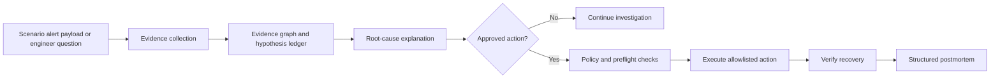

# OpsPilot

> Evidence-first incident response for Kubernetes, with human-approved remediation.

OpsPilot is a conversational SRE copilot for the OpenAI Build Week Developer Tools
track. It brings Kubernetes events, logs, metrics, and deployment history into one
incident investigation, helping on-call engineers understand what changed, assess
impact, and decide on a safe response.

## Current build

The local demonstration includes:

- a FastAPI health endpoint and Alertmanager generic-webhook v4-compatible
  scenario ingress;
- delivery-retry, alert-update, resolved-signal, and reset/new-run idempotency
  behavior backed by SQLite;
- typed, bounded Prometheus and Kubernetes workload-status adapters;
- typed Kubernetes event, redacted log-excerpt, and deployment-history adapters;
- server-owned lifecycle transitions, persisted alert evidence, and an evidence timeline;
- allowlist policy contracts that reject cross-namespace, stale, and unapproved action plans;
- a real local kind environment with a checkout service, Prometheus, and a load
  generator; and
- P1: a controlled checkout rollout that changes live traffic from HTTP 200 to
  HTTP 500, produces Prometheus 5xx telemetry, and recovers after reset.

## Why OpsPilot

During an incident, the important signals are usually available but split across
multiple tools. OpsPilot does not replace Kubernetes, Prometheus, or an on-call
engineer. It brings evidence together into one investigation and keeps every
change behind an explicit approval gate.

The product is designed around four principles:

- **Evidence before conclusions.** Every hypothesis links to the logs, metrics,
  events, or deployment change that supports it.
- **Constrained remediation.** The model cannot run arbitrary commands. It may
  recommend only allowlisted actions with typed inputs and preflight checks.
- **A human stays accountable.** A rollback, restart, or scale operation requires
  explicit approval from the engineer.
- **Recovery must be demonstrated.** An action is not marked successful until
  health checks and relevant service indicators return to their defined baseline.

## Scenario design

OpsPilot is organized around two representative Kubernetes incident scenarios.
When a scenario runs, its logs, events, deployment history, and metrics are
generated by the local environment.

| Incident | Trigger | Expected investigation | Approved recovery |
| --- | --- | --- | --- |
| P1: checkout degradation | Bad checkout deployment | Link the 5xx increase to the recent deployment revision | Roll back the deployment and verify error-rate recovery |
| P2: workload instability | Controlled memory leak | Link restarts and OOMKill events to the affected workload | Restart or scale the workload and verify pod and service health |

## Product flow



## Target engineer questions

- Which service has the highest 5xx rate right now?
- What changed before the incident began?
- What evidence supports the current root-cause hypothesis?
- What is the likely blast radius?
- What action do you recommend, what will it change, and how will we verify it?

## Local prerequisites

- Docker Desktop with Kubernetes-compatible containers enabled
- `kind` and `kubectl`
- Python 3.12+ and Node.js 20+
- An OpenAI API key with access to the Build Week-required GPT-5.6 model

Copy `.env.example` to `.env` and add local configuration there. Credentials are
never committed to the repository.

## Run locally

The commands below are verified on Windows PowerShell with Docker Desktop, kind,
kubectl, Python, Node, npm, and `uv`.

```powershell
uv sync --all-groups
.\scripts\verify.ps1

# Starts the dedicated local kind cluster, checkout service, Prometheus, and load generator.
.\scripts\scenario.ps1 create

# In a separate terminal, start the local API.
uv run uvicorn opspilot.api.main:app --app-dir backend --host 127.0.0.1 --port 8000
```

In another PowerShell terminal, exercise P1 and create its controlled scenario
alert:

```powershell
.\scripts\scenario.ps1 inject-p1
.\scripts\send-p1-alert.ps1
.\scripts\scenario.ps1 reset-p1
.\scripts\scenario.ps1 status

# Runs the controlled P1 integration test against kind, then resets the scenario.
.\scripts\test-e2e-p1.ps1
```

`create` uses only the dedicated `opspilot-dev` kind cluster. The scenario commands
intentionally modify the checkout deployment in its `opspilot-demo` namespace;
they do not target an external cluster.

## Safety model

OpsPilot is designed for a controlled Kubernetes environment. It uses typed,
bounded access to Kubernetes and Prometheus rather than arbitrary shell commands
or unrestricted PromQL. Proposed actions are constrained by an allowlist and
require explicit engineer approval.
