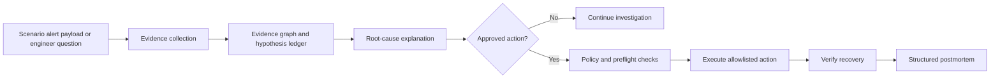

# OpsPilot

> Evidence-first incident response for Kubernetes, with human-approved remediation.

OpsPilot is a conversational SRE copilot for the OpenAI Build Week Developer Tools
track. It brings Kubernetes events, logs, metrics, and deployment history into one
incident investigation, helping on-call engineers understand what changed, assess
impact, and decide on a safe response.

## Current build

The local demonstration includes:

- a FastAPI health endpoint and Alertmanager generic-webhook v4-compatible
  scenario ingress;
- delivery-retry, alert-update, resolved-signal, and reset/new-run idempotency
  behavior backed by SQLite;
- typed, bounded Prometheus and Kubernetes workload-status adapters;
- typed Kubernetes event, redacted log-excerpt, and deployment-history adapters;
- server-owned lifecycle transitions, persisted alert evidence, and an evidence timeline;
- a server-owned action plan with a Kubernetes dry-run preview, evidence binding,
  explicit approval, fingerprint and target-version staleness checks, and an
  append-only audit trail;
- an independent recovery verifier that checks workload readiness and a bounded
  checkout 5xx recovery indicator;
- an evidence-backed incident command center with current Prometheus rates,
  workload health, Kubernetes events, deployment history, evidence timeline,
  follow-up investigation input, approval controls, and an audit-derived
  postmortem draft; unknown blast radius, SLO, and model confidence are shown
  explicitly rather than inferred;
- a five-second refresh of the controlled dashboard and a bounded evidence
  collection step before every investigation request; unchanged event and
  deployment records are deduplicated while fresh telemetry is retained; and
- a real local kind environment with a checkout service, Prometheus, and a load
  generator; and
- P1: a controlled checkout rollout that changes live traffic from HTTP 200 to
  HTTP 500, produces Prometheus 5xx telemetry, and recovers after reset; and
- local rehearsal controls that start a fresh P1 or P2 incident from the console.
  They modify only the dedicated demo checkout workload and retain the same
  preview, approval, audit, recovery, and RCA gates as the command-line path.
- an auto-refreshing local on-call queue backed by persisted incident records.
  The newest relevant incident is selected on load, and `?incident=<id>` permits
  a reproducible deep link for a reviewer or screenshot.

The GPT-5.6 investigation route is contract-tested, but direct OpenAI validation
is currently blocked by project quota. The controlled Kubernetes evidence and
remediation flows are verified independently; do not treat the conversational
investigation as demonstrated until a live provider run is recorded.

## Why OpsPilot

During an incident, the important signals are usually available but split across
multiple tools. OpsPilot does not replace Kubernetes, Prometheus, or an on-call
engineer. It brings evidence together into one investigation and keeps every
change behind an explicit approval gate.

The product is designed around four principles:

- **Evidence before conclusions.** Every hypothesis links to the logs, metrics,
  events, or deployment change that supports it.
- **Constrained remediation.** The model cannot run arbitrary commands. It may
  recommend only allowlisted actions with typed inputs and preflight checks.
- **A human stays accountable.** Every allowlisted remediation operation requires
  explicit approval from the engineer.
- **Recovery must be demonstrated.** An action is not marked successful until
  health checks and relevant service indicators return to their defined baseline.

## Scenario design

OpsPilot is organized around two representative Kubernetes incident scenarios.
When a scenario runs, its logs, events, deployment history, and metrics are
generated by the local environment.

| Incident | Trigger | Expected investigation | Approved recovery |
| --- | --- | --- | --- |
| P1: checkout degradation | Controlled response-mode rollout | Link the 5xx increase to the recent deployment revision | Restore the controlled response mode and verify error-rate recovery |
| P2: workload instability | Controlled memory leak | Link restarts and OOMKill events to the affected workload | Restore the controlled memory mode and verify pod health |

## Product flow



## Questions queued for live GPT-5.6 validation

- What evidence supports the current root-cause hypothesis?

Broader service ranking and blast-radius answers remain architecture targets, not
current submitted-build claims.

## Local prerequisites

- Docker Desktop with Kubernetes-compatible containers enabled
- `kind` and `kubectl`
- Python 3.12+ and Node.js 20+
- For local model testing: an OpenRouter key with access to a GPT-5.6 model
- For the final live validation and demo recording: an OpenAI API key with
  billing/model access and `api.responses.write`

Copy `.env.example` to `.env` and add local configuration there. Credentials are
never committed to the repository.

Set `LLM_PROVIDER=openrouter` for the lower-cost test path; it uses the
OpenAI-compatible Responses endpoint and the configured `OPENROUTER_MODEL`.
Set `LLM_PROVIDER=openai` before final validation and recording. The intended
final validation uses direct OpenAI; an OpenRouter run is not presented as that
final validation.

## Run locally

The commands below are verified on Windows PowerShell with Docker Desktop, kind,
kubectl, Python, Node, npm, and `uv`.

```powershell
uv sync --all-groups
.\scripts\verify.ps1

# Starts the dedicated local kind cluster, checkout service, Prometheus, and load generator.
.\scripts\scenario.ps1 create

# In a separate terminal, start the local API.
uv run uvicorn opspilot.api.main:app --app-dir backend --host 127.0.0.1 --port 8000
```

In another PowerShell terminal, exercise P1 and create its controlled scenario
alert:

```powershell
.\scripts\scenario.ps1 inject-p1
.\scripts\send-p1-alert.ps1
.\scripts\scenario.ps1 reset-p1
.\scripts\scenario.ps1 status

# Runs the controlled P1 integration test against kind, then resets the scenario.
.\scripts\test-e2e-p1.ps1

# Runs the complete controlled P1 approval/recovery path against kind. It starts
# a temporary local Prometheus port-forward and resets the scenario afterward.
.\scripts\test-e2e-p1-remediation.ps1
```

`create` uses only the dedicated `opspilot-dev` kind cluster. The scenario commands
intentionally modify the checkout deployment in its `opspilot-demo` namespace;
they do not target an external cluster.

Alternatively, open `http://127.0.0.1:5173` after starting the API and use the
rehearsal selector and **Start rehearsal** button beside **Open**. Select P1 to
create a new triaging incident and change only the checkout response mode. Wait
for the five-second dashboard refresh to show the live 5xx trend, then use the
normal dry-run, approval, recovery, and RCA controls. **Reset** restores the two
controlled scenario toggles; it does not approve or execute a remediation.

For the credential-free prebuilt-image reviewer path, see [JUDGE_PATH.md](JUDGE_PATH.md).

For a complete controlled on-call walkthrough—from starting P1/P2 through
evidence review, approved remediation, independent verification, and RCA—see
[the on-call rehearsal guide](docs/USER_GUIDE.md).

## Safety model

OpsPilot is designed for a controlled Kubernetes environment. It uses typed,
bounded access to Kubernetes and Prometheus rather than arbitrary shell commands
or unrestricted PromQL. Proposed actions are constrained by an allowlist and
require explicit engineer approval.
