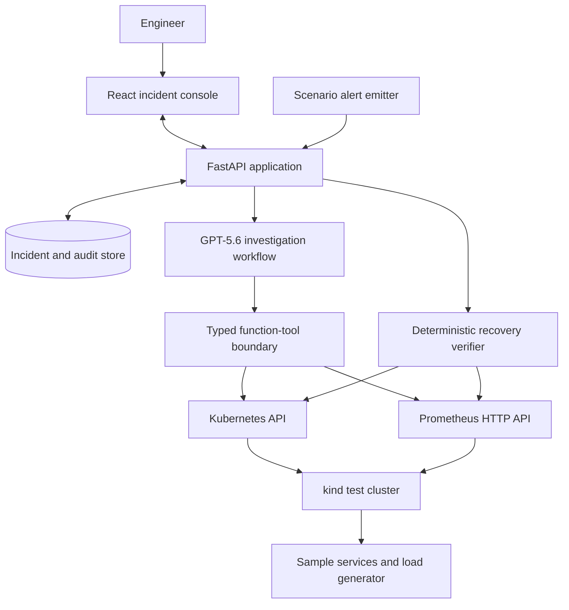
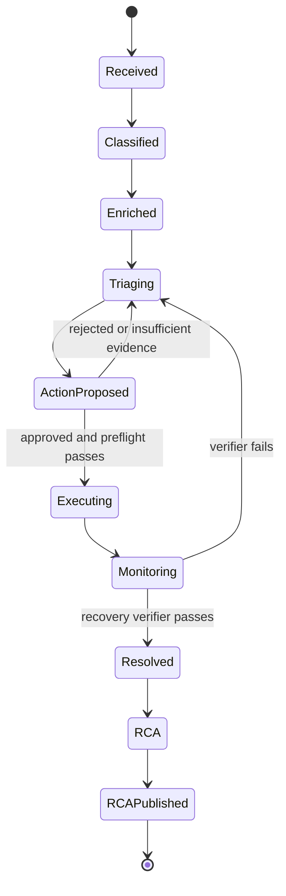
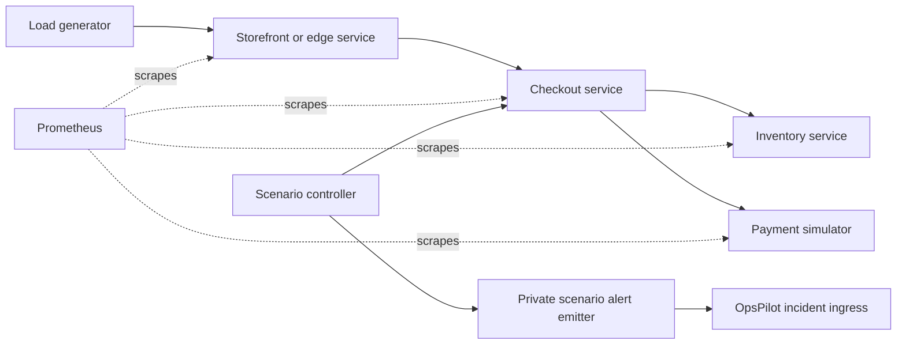

# OpsPilot architecture

> **Implementation status:** This is an architecture specification. A component
> or behavior is planned unless [PROGRESS.md](PROGRESS.md) records it as verified.
> Do not describe this specification as implemented in the README, Devpost form,
> screenshots, or video without supporting evidence.

## 1. Product boundary

OpsPilot is a controlled, evidence-first incident-response application for a local
Kubernetes test environment. Its job is to investigate, explain, propose, approve,
execute, verify, and document an incident. It does not make unattended changes and
does not expose arbitrary shell or raw PromQL execution to the model.

The design is intentionally enterprise-shaped while remaining buildable in a
hackathon: every conclusion has provenance, every action has policy checks, and
every recovery is independently verified.

## 2. System context



### Components

| Component | Responsibility | Safety boundary |
| --- | --- | --- |
| React incident console | Displays lifecycle, evidence, hypotheses, approval requests, and postmortems | Never receives an OpenAI API key |
| FastAPI application | Owns API contracts, incident state, authorization, audit records, and orchestration | Only component allowed to invoke tools |
| Investigation workflow | Uses GPT-5.6 to choose evidence gathering steps and synthesize structured results | Receives bounded tool outputs, not cluster credentials |
| Tool adapters | Read K8s/Prometheus data and execute allowlisted actions | Typed inputs, timeouts, namespace restrictions, redaction |
| Policy engine | Validates action type, target, preconditions, and approval | Denies unsafe or stale action plans |
| Recovery verifier | Independently checks health after an action | Cannot mark an incident resolved from model text alone |
| Audit store | Records evidence references, hypotheses, decisions, action results, and verification | Append-only logical record per incident |

### Incident ingress for the submitted build

The first build has two explicit incident entry points:

1. an engineer question or manual incident creation in the console; and
2. a private scenario-alert emitter that sends an Alertmanager generic-webhook
   **version 4-compatible** payload to the backend when P1 or P2 is injected.

The Pydantic contract matches the standard top-level fields `version`, `groupKey`,
`truncatedAlerts`, `status`, `receiver`, `groupLabels`, `commonLabels`,
`commonAnnotations`, `externalURL`, and `alerts`. Each alert accepts `status`,
`labels`, `annotations`, `startsAt`, `endsAt`, `generatorURL`, and `fingerprint`.
The scenario-specific run ID is put in each alert's standard `labels` as
`opspilot_run_id`, appears in `commonLabels` for the single-scenario group, and is
included in the controlled emitter's `groupKey`; source links use `generatorURL`
and annotations. The emitter does not add a custom top-level field.

This is payload compatibility, not an implemented Alertmanager integration. Once
the endpoint is implemented and tested against a captured Alertmanager v4 fixture,
a later Alertmanager webhook can send the same contract without an adapter.

### Ingress idempotency and reset behavior

The backend calculates the stable incident key as a SHA-256 hash of the payload
version, `groupKey`, and sorted alert fingerprints. Status is deliberately not in
this key, so a later `resolved` notification targets the original incident.

- An identical delivery hash over the full canonicalized v4 payload (including
  annotations and status) is ignored as a webhook retry. This delivery hash is
  intentionally distinct from the stable incident key.
- A non-identical `firing` payload with an existing open incident key appends a
  timestamped alert-update evidence record; it never opens a duplicate incident.
- A `resolved` payload appends a resolution signal, but cannot resolve the incident:
  only the independent recovery verifier can do that.
- `reset` creates a new `opspilot_run_id`, which must participate in `groupKey` and
  therefore produces a new incident key for the next scenario run.

This makes repeated deliveries safe while ensuring rehearsals after a reset create
new, auditable incidents.

Prometheus alert rules and Alertmanager are **not** part of the initial submission
scope. Do not say that OpsPilot watches Alertmanager or receives production alerts
unless that integration is later implemented, tested, and recorded in
`PROGRESS.md`.

## 3. Incident lifecycle



State changes are server-owned and audited. A model response may recommend a
transition, but it cannot set `Executing`, `Resolved`, or `RCAPublished` directly.

## 4. Evidence-first investigation

### Evidence record

Each collected item is normalized into a structured evidence record:

```text
EvidenceRecord
  id, incident_id, source_type, source_ref, observed_at
  workload, namespace, deployment_revision
  summary, structured_payload, content_hash
  collection_status, collected_at
```

`source_ref` is rendered in the interface so an engineer can inspect the exact
event, log slice, metric query, or deployment revision that supports a claim.

### Evidence graph and hypothesis ledger

The backend builds a small typed graph from the current incident:

- **nodes:** alerts, services, workloads, deployments, pods, metric windows, log
  signatures, Kubernetes events, actions, and verification checks;
- **edges:** `observed-on`, `deployed-before`, `depends-on`, `supports`,
  `contradicts`, and `affects`;
- **hypotheses:** a short ranked ledger containing cause, affected component,
  supporting evidence IDs, contradictory evidence IDs, confidence, and next best
  evidence request.

This avoids a common failure mode in incident assistants: presenting a fluent
answer with no way to inspect or challenge its basis. The interface must show at
least one supporting source for every root-cause and blast-radius statement.

### Retrieval strategy

The workflow starts with parallel, bounded read-only calls:

1. current pod and deployment state;
2. relevant Kubernetes events and restart history;
3. recent, redacted pod-log tails;
4. predefined Prometheus query templates for error rate, latency, and restarts;
5. deployment revisions and timestamps.

The agent may request a second, narrow collection pass only when the first pass
does not discriminate between hypotheses. It must say what it needs and why.

## 5. Tool boundary

The first implementation uses direct Python function tools. It does **not** use
MCP. Each tool has a Pydantic request/response contract, timeout, namespace
allowlist, and audit event.

### Read-only tools

| Tool | Purpose |
| --- | --- |
| `get_incident_snapshot` | Return current incident metadata and lifecycle state |
| `get_workload_status` | Return pods, readiness, restarts, and resource status for an allowed workload |
| `get_kubernetes_events` | Return time-bounded warning and normal events |
| `get_log_excerpt` | Return redacted, bounded log lines for a selected pod/container/window |
| `get_service_metrics` | Run a selected metric template with validated parameters |
| `get_deployment_history` | Return revision, image, timestamp, and rollout status |
| `get_blast_radius` | Derive directly affected services from configured service dependencies and current signals |

### Action tools

| Tool | Preconditions | Verification |
| --- | --- | --- |
| `restore_response_mode` | P1 evidence is attached and the checkout target has not changed | Restore the controlled response mode; readiness, the 15-second 5xx indicator, and observed 2xx traffic meet the configured thresholds |
| `restore_memory_mode` | P2 evidence is attached and the checkout target has not changed | Restore the controlled memory mode; readiness and restart count remain stable for 30 seconds |
| `restart` | Target is allowlisted and current health evidence is attached | Replacement pod becomes ready and restart count remains stable for 30 seconds; not a demonstrated P2 cure |
| `scale` | Target and replica bounds are allowlisted | Desired replicas become ready; not a demonstrated P2 cure |

Action tools are split into `propose`, `approve`, `execute`, and `verify` phases.
There is no tool that lets the model execute a free-form cluster command.

An action proposal is a server-created, canonical `ActionPlan`, not model text. It
contains the action type, target, bounded parameters, expected prior revision,
verification contract, and an expiry. The server performs a Kubernetes dry-run
with the same verb and payload before it renders the approval card. The card
shows the returned preview and a normalized diff when one can be computed.

A dry-run is useful evidence of the requested change, but it is not a guarantee
of the exact live result: admission, controllers, or cluster state can change
between preview and execution. Approval is therefore bound to the action-plan
fingerprint and target `resourceVersion`; execution rejects a stale plan and
requires a new preview and approval.

## 6. Four-gate action policy

Every remediation must pass all four gates:

1. **Allowlisted action:** only controlled response restoration, controlled memory restoration, restart,
   and scale are available; each has target and parameter bounds.
2. **Preflight and preview:** current incident state, target namespace, expected
   deployment revision, and safety conditions are checked; the server then performs
   the bounded Kubernetes dry-run used in the approval preview.
3. **Human approval:** the UI displays the preview, rationale, expected effect,
   and verification plan. Approval is tied to the action-plan fingerprint and
   current target version, and creates the audit record.
4. **Post-action verification:** the verifier checks rollout health plus the
   incident-specific service indicators. It can fail a remediation and reopen
   investigation.

In the controlled local demo, the approver field is a self-declared engineer
identifier recorded for traceability. A production deployment would bind this
step to authenticated identity and authorization; the current build does not
claim to provide that integration.

## 7. Model workflow and outputs

The application uses the OpenAI Responses API with direct Python function tools.
The model is configured through `OPENAI_MODEL`; deployment must set it to the
Build-Week-required GPT-5.6 model identifier available to the account. The model
is reserved for bounded evidence synthesis and follow-up questions. The current
postmortem endpoint is deterministic and audit-derived; it does not claim to be
model-written.

The current implementation exposes only server-owned incident snapshot and
persisted-evidence tools to the model. The broader Kubernetes and Prometheus
retrieval set in this architecture is a design target until a live GPT-5.6 run
uses it and [PROGRESS.md](PROGRESS.md) records the evidence.

The initial candidate is `gpt-5.6-terra` with `medium` reasoning effort. Before
agent implementation, a server-side smoke test must verify account availability
and a representative structured tool-call fixture. For each candidate, the saved
result records fixture version, pass/fail, wall-clock latency, input/output and
cached token usage where returned, tool-call count, and a dated estimated cost
based on a saved pricing snapshot. The selected model ID, reasoning effort, and
GPT-5.6-only fallback order are recorded in ignored local configuration. Do not
treat the `gpt-5.6` alias as an independent fallback: it currently routes to
`gpt-5.6-sol`.

### Model policy

OpenAI is the primary model provider for every user-facing investigation and demo
flow. This is both the intended product design and a Build Week requirement: the
core project must be built with Codex and GPT-5.6. Ollama may be used only as an
optional local-development aid, such as an offline fixture test or UI smoke test.
It must not replace GPT-5.6 in the submitted workflow or be represented as the
model used for the demonstrated investigation.

OpenRouter may be used only as a lower-cost local test provider when it reaches
the configured GPT-5.6 model. It is not the final validation, submitted-demo, or
recording provider; those activities use the direct OpenAI API.

The backend owns all provider calls. It reads a server-side API key and model
configuration from the ignored environment file, applies request timeouts and
per-incident budgets, and records model-call metadata in the audit trace without
recording secrets or sensitive raw content. Per-incident audit metadata includes
the model ID, timing, token usage where returned, tool-call count, and estimated
cost with its pricing-snapshot date; it must never invent a cost when usage or
pricing data is unavailable.

Important implementation rules:

- Use structured Pydantic output for hypotheses, action proposals, and postmortems.
- Set a bounded maximum number of investigation turns and tool calls.
- Handle tool failures as evidence gaps, never as proof of a hypothesis.
- Keep the agent's current incident context in a server-side session keyed by
  `incident_id`; do not depend on browser-local chat history. The console polls
  the bounded local open-incident queue and supports `?incident=<id>` deep
  links; the selected incident remains server-owned.
- Stream selected-incident lifecycle and tool-status events to the UI over
  Server-Sent Events (SSE). The browser polls the small local queue every five
  seconds, avoiding a second event stream; chat and approval use ordinary HTTP.

The Responses API supports direct function tools and structured arguments, which
fit this bounded investigation design.

## 8. Simulation environment

The demo runs a real local kind cluster with real containers, Kubernetes events,
and Prometheus scrapes. Failures are injected intentionally, but the resulting
telemetry is generated by the live environment.



### Minimum incident contracts

**P1: controlled checkout response-mode rollout**

- trigger: change the controlled checkout response mode under live traffic;
- observable: elevated HTTP 5xx, a changed deployment revision, and relevant logs;
- correct recovery: restore the controlled response mode through the allowlisted
  `restore_response_mode` action;
- recovery: rollout healthy, the error-rate query returns below the configured
  baseline, and the 2xx query confirms traffic is flowing in the verification window.

**P2: memory leak / OOMKill**

- trigger: enable a controlled memory-growth path under load;
- observable: OOMKill event, restart increase, pod instability, and service impact;
- correct recommendation: restore the controlled memory mode through the configured action policy;
- recovery: ready replicas meet target and the observed restart count does not increase for 30 seconds.

## 9. Persistence and observability

Use SQLite for the hackathon build behind repository interfaces, so the test
environment remains easy to run. Keep tables for incidents, evidence, hypotheses,
actions, approvals, verification runs, and postmortems. The interfaces should be
portable to PostgreSQL later without changing the domain model.

Application logs use structured JSON with `incident_id`, `tool_call_id`, and
`action_id`. Never log API keys or unredacted sensitive payloads. Emit a compact
agent trace for each run: tool called, duration, result status, evidence IDs used,
and lifecycle transition.

## 10. Security and trust requirements

- Keep OpenAI credentials on the server only.
- Restrict all K8s reads and writes to the dedicated demo namespace.
- Redact configured sensitive log patterns before sending excerpts to the model.
- Treat logs and other tool outputs as untrusted data: they cannot add tools,
  bypass the server-owned incident ID, or execute actions; a conflicting or
  adversarial excerpt is displayed as evidence rather than an instruction.
- Use exact workload IDs and resource versions in action preflight checks.
- Refuse destructive actions, cross-namespace actions, and actions outside the
  allowlist.
- Display evidence gaps and conflicting signals instead of inventing certainty.
- Keep synthetic demo data free of personal or production customer data.

## 11. Acceptance criteria

The demo is complete only when both incidents can be reset and rerun from a clean
cluster, and each run demonstrates:

1. a validated scenario-alert payload or engineer question starts an incident;
2. live evidence is collected and visible;
3. the expected root-cause hypothesis cites evidence;
4. an action is proposed but cannot execute without approval;
5. the approved action is audited;
6. recovery is verified by deterministic health checks; and
7. a structured postmortem is generated from the recorded incident history.

## 12. Evaluation contract

The repository will provide `make eval` once the agent workflow exists. It will
run named, resettable scenarios and save machine-readable results instead of
turning a demo impression into a performance claim. At minimum it measures:

1. whether the expected cause is present and evidence-linked;
2. whether an output with an unsupported evidence reference is rejected; and
3. whether a disallowed or unapproved action is blocked.

The harness will report the scenario version, model configuration, run count,
individual results, aggregate result, failures, and artifact location. Results
may be published only after repeated runs are saved; they describe this controlled
test environment, not production incident performance.
